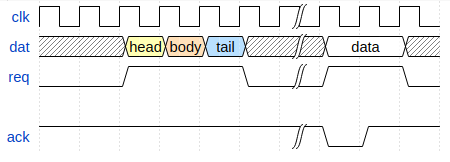

# mdbook-wavedrom

A preprocessor for [mdbook][] to add [wavedrom][] support.
This is based diretly on [mdbook-mermaid][], and is basically just a search/replace.

[mdbook]: https://github.com/rust-lang-nursery/mdBook
[wavedrom]: https://github.com/wavedrom/wavedrom
[mdbook-mermaid]: https://github.com/badboy/mdbook-mermaid

It turns this:

~~~
```wavedrom
{signal: [
  {name: 'clk', wave: 'p.....|...'},
  {name: 'dat', wave: 'x.345x|=.x', data: ['head', 'body', 'tail', 'data']},
  {name: 'req', wave: '0.1..0|1.0'},
  {},
  {name: 'ack', wave: '1.....|01.'}
]}
```
~~~

into this:



in your book.
(Graph provided by [wavedrom Live Editor](https://wavedrom.com/editor.html)

## Installation

If you want to use only this preprocessor, install the tool:

```
cargo install mdbook-wavedrom
```

Then let `mdbook-wavedrom` add the required files and configuration:

```
mdbook-wavedrom install path/to/your/book
```


This will add the following configuration to your `book.toml`:

```toml
[preprocessor.wavedrom]
command = "mdbook-wavedrom"

[output.html]
additional-js = ["wavedrom.min.js", "wavedrom-default.js"]
```

It will skip any unnecessary changes and detect if `mdbook-wavedrom` was already configured.

Additionally it copies the files `wavedrom.min.js` and  `wavedrom-default.js` into your book's directory.
You find these files in the [`src/bin/assets`](src/bin/assets) directory.
You can modify `wavedrom-defalut.js` to configure wavedrom, see the [wavedrom documentation] for all options.

[wavedrom documentation]: https://github.com/wavedrom/wavedrom

Finally, build your book:

```
mdbook path/to/book
```

## License

MPL. See [LICENSE](LICENSE).  